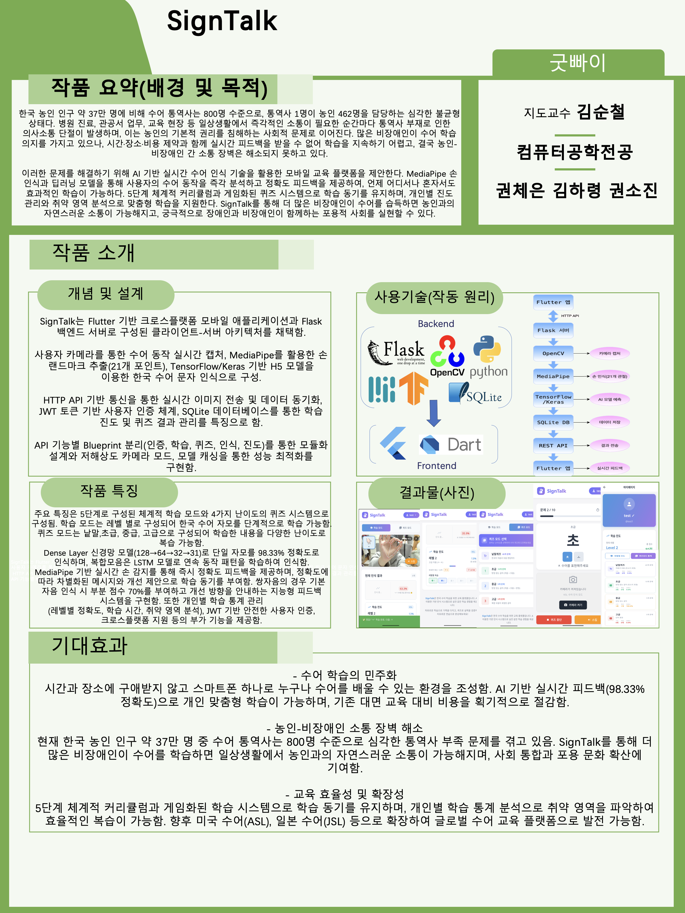

# SignTalk

수어 번역 및 학습 플랫폼





---

## 목차
- [프로젝트 구조](#프로젝트-구조)
- [가상환경 설정](#가상환경-설정)
- [패키지 설치](#패키지-설치)
- [백엔드 실행](#백엔드-실행)
- [프론트엔드 실행](#프론트엔드-실행)
- [Git 사용법](#git-사용법)

---

## 프로젝트 구조

```
SignTalk/
├── myproject/          # Flask 백엔드
├── front/              # Flutter 프론트엔드
└── ksl_model_train/    # 수어 모델 학습
```

---

## 가상환경 설정

### macOS / Linux

#### Bash 셸
```bash
# 가상환경 생성
python3 -m venv signtalk_env

# 가상환경 활성화
source signtalk_env/bin/activate

# 가상환경 비활성화
deactivate
```

#### Fish 셸
```fish
# 가상환경 생성
python3 -m venv signtalk_env

# 가상환경 활성화
source signtalk_env/bin/activate.fish

# 가상환경 비활성화
deactivate
```

#### Zsh 셸
```zsh
# 가상환경 생성
python3 -m venv signtalk_env

# 가상환경 활성화
source signtalk_env/bin/activate

# 가상환경 비활성화
deactivate
```

### Windows

#### CMD
```cmd
# 가상환경 생성
python -m venv signtalk_env

# 가상환경 활성화
signtalk_env\Scripts\activate.bat

# 가상환경 비활성화
deactivate
```

#### PowerShell
```powershell
# 가상환경 생성
python -m venv signtalk_env

# 가상환경 활성화
signtalk_env\Scripts\Activate.ps1

# 가상환경 비활성화
deactivate
```

#### Git Bash
```bash
# 가상환경 생성
python -m venv signtalk_env

# 가상환경 활성화
source signtalk_env/Scripts/activate

# 가상환경 비활성화
deactivate
```

---

## 패키지 설치

### 백엔드 패키지 설치 (Python)

#### macOS / Linux
```bash
# 가상환경 활성화 후
cd myproject
pip install -r requirements.txt
```

#### Windows
```cmd
# 가상환경 활성화 후
cd myproject
pip install -r requirements.txt
```

### 프론트엔드 패키지 설치 (Flutter)

#### 모든 OS 공통
```bash
cd front
flutter pub get
```

---

## 백엔드 실행

### macOS / Linux

```bash
# 1. 가상환경 활성화 (위 섹션 참고)
source signtalk_env/bin/activate

# 2. 의존성 설치
cd myproject
pip install -r requirements.txt

# 3. 데이터베이스 테이블 생성
python create_tables.py

# 4. 서버 실행
python app.py
# 또는 디버그 모드
python debug_server.py
```

### Windows

```cmd
# 1. 가상환경 활성화 (위 섹션 참고)
signtalk_env\Scripts\activate.bat

# 2. 의존성 설치
cd myproject
pip install -r requirements.txt

# 3. 데이터베이스 테이블 생성
python create_tables.py

# 4. 서버 실행
python app.py
# 또는 디버그 모드
python debug_server.py
```

---

## 프론트엔드 실행

### 사전 요구사항
- Flutter SDK 설치 필요: https://flutter.dev/docs/get-started/install

### macOS

```bash
# 1. 프론트엔드 디렉토리로 이동
cd front

# 2. 의존성 설치
flutter pub get

# 3. 의존성 업데이트 확인 (선택사항)
flutter pub outdated

# 4. 실행
# macOS 앱으로 실행
flutter run -d macos

# Chrome 브라우저로 실행
flutter run -d chrome

# iOS 시뮬레이터로 실행
flutter run -d ios

# Android 에뮬레이터로 실행
flutter emulators --launch Pixel_7
flutter run
```

### Linux

```bash
# 1. 프론트엔드 디렉토리로 이동
cd front

# 2. 의존성 설치
flutter pub get

# 3. 실행
# Linux 앱으로 실행
flutter run -d linux

# Chrome 브라우저로 실행
flutter run -d chrome

# Android 에뮬레이터로 실행
flutter emulators --launch Pixel_7
flutter run
```

### Windows

```cmd
# 1. 프론트엔드 디렉토리로 이동
cd front

# 2. 의존성 설치
flutter pub get

# 3. 실행
# Windows 앱으로 실행
flutter run -d windows

# Chrome 브라우저로 실행
flutter run -d chrome

# Android 에뮬레이터로 실행
flutter emulators --launch Pixel_7
flutter run
```

### 핫 리로드
앱이 실행 중일 때 터미널에서 `r` 키를 누르면 핫 리로드됩니다.

---

## Git 사용법

### 특정 브랜치의 폴더 가져오기

```bash
# 1. 원격 브랜치 정보 가져오기
git fetch origin 브랜치명

# 2. 특정 폴더만 체크아웃
git checkout origin/브랜치명 -- 폴더명/
```

예시:
```bash
git fetch origin feature/new-feature
git checkout origin/feature/new-feature -- myproject/
```

---

## 개발 환경

- Python: 3.12+
- Flutter: 3.9.2+
- Flask: 3.1.2
- TensorFlow: 2.19.1

---

## 문제 해결

### Python 가상환경이 활성화되지 않을 때
- macOS/Linux: `which python`으로 경로 확인
- Windows: `where python`으로 경로 확인

### Flutter 명령어가 인식되지 않을 때
```bash
flutter doctor
```
위 명령어로 Flutter 설치 상태를 확인하세요.

### 포트 충돌 시
백엔드 기본 포트를 변경하려면 `myproject/app.py` 또는 `myproject/config.py`를 수정하세요.
